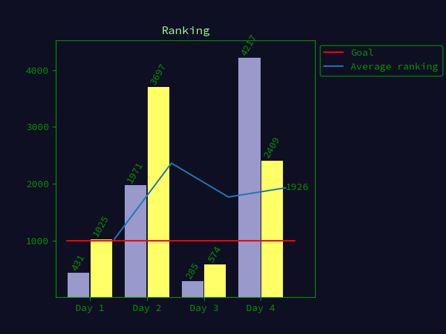

# AoC 24

Repo for 2024 AoC solutions.

## About `today.py`

CLI to download puzzle input.

This script does follow the [automation guidelines](https://www.reddit.com/r/adventofcode/wiki/faqs/automation) on the /r/adventofcode community wiki. Specifically:
- Outbound calls are throttled to every 15 minutes via a timestamp file stored in the user folder `$HOME/.cache/aoc_today_ts`
- Once inputs are downloaded, they are cached locally in `./inputs[/{year}]/day{day}.txt` (the script will never overwrite these files)
  - If you suspect your input is corrupted, you can manually request a fresh copy by deleting both `$HOME/.cache/aoc_today_ts` and `./inputs[/{year}]/day{day}.txt`
- The User-Agent header is set to this repo and my contact info.

## About `setup.sh`

Sets up a correct `venv` and installs all required packages. Will skip the setup and just activate if it already exists.

## Times

```
imported: 5 solution(s) in 663 μs
running: all with benchmark
day1.part1: ~ (645 μs 15491 samples)
day1.part2: ~ (19 ms 535 samples)
day2.part1: ~ (1209 μs 8267 samples)
day2.part2: ~ (4902 μs 2040 samples)
day3.part1: ~ (285 μs 35011 samples)
day3.part2: ~ (387 μs 25840 samples)
day4.part1: ~ (15 ms 670 samples)
day4.part2: ~ (19 ms 537 samples)
day5.part1: ~ (2110 μs 4738 samples)
day5.part2: ~ (1589 μs 6294 samples)
total: 63 ms
```

## Score

```{scores}
      -------Part 1--------   -------Part 2--------
Day       Time  Rank  Score       Time  Rank  Score
  5   00:07:53   820      0   00:16:40  1098      0
  4   00:20:38  4217      0   00:24:06  2409      0
  3   00:02:15   285      0   00:07:34   574      0
  2   00:08:38  1971      0   00:24:36  3697      0
  1   00:02:17   431      0   00:05:41  1025      0

```



## Environment

Description of my setup and how I use it.

* I use `setup.sh` for activating and configuring the python virtual environment.
* I usually have two terminals open, one for editing in NeoVim and one for running scripts/solutions. `start.sh` will create the terminal windows and setup the virtual environment in both.
* When each day's challenge is released I run `today.py` wich will download the input into `input/day{nr}.txt`. Any example inputs that I want to use I manually put under `input/day{nr}.{example nr}.txt`.
* `aoc.py` is a *runner* which will by default run functions `part1` and `part2` in `day{nr}.py` on the corresponding tests and input. `run.sh` will run this *runner* at any time when a solution is updated.
* To benchmark, `aoc.py --all --bench --hide --no-test` will hide the answers and only output the measured time for running each part on the corresponding input.
